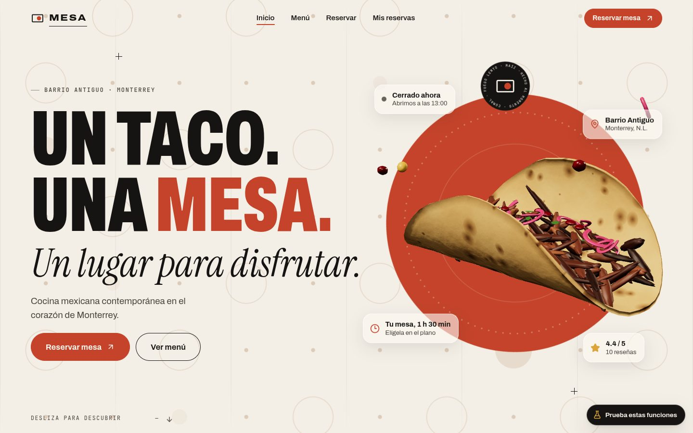
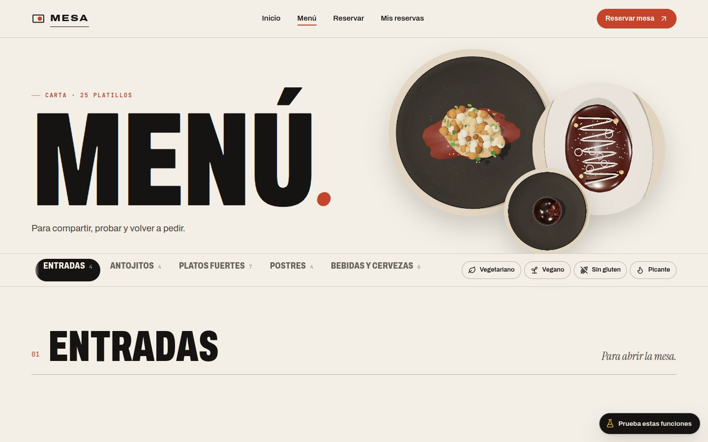
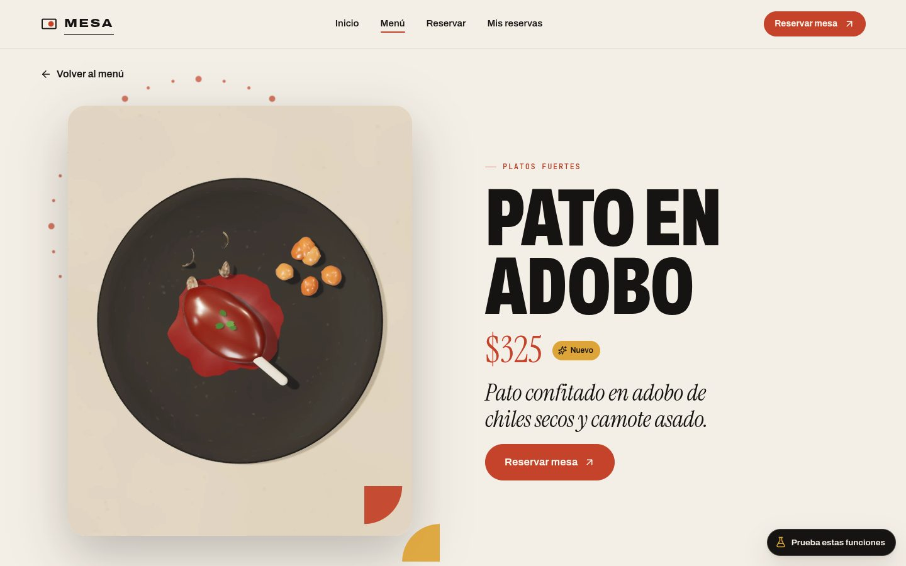
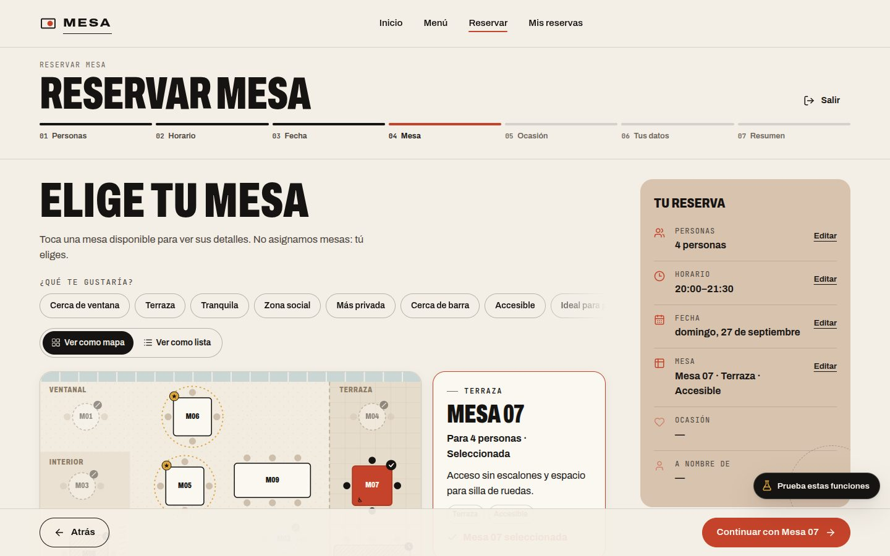
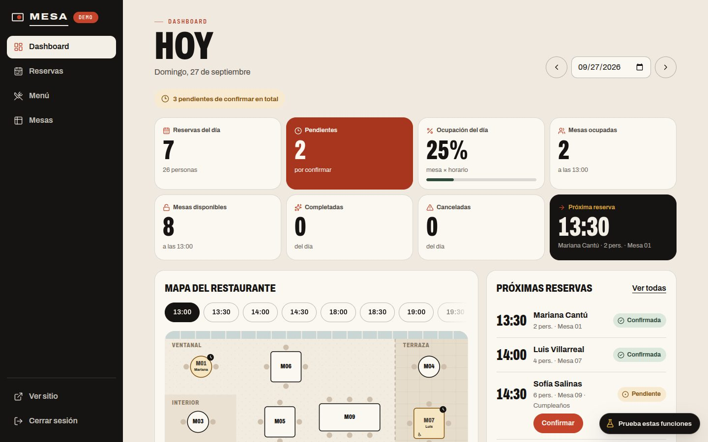
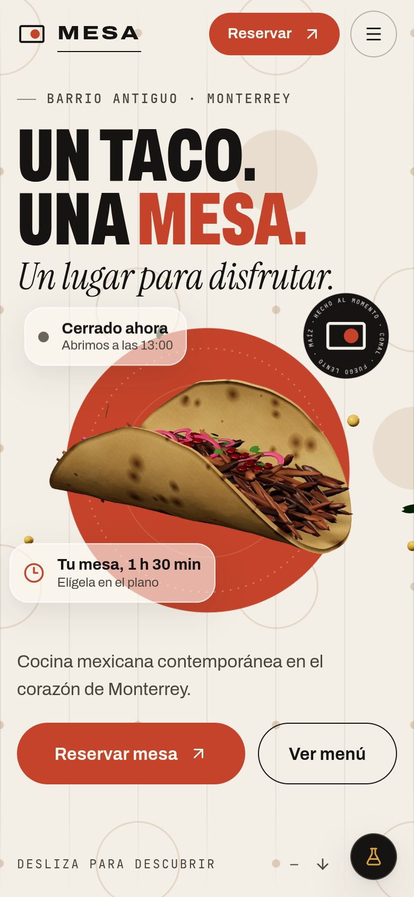
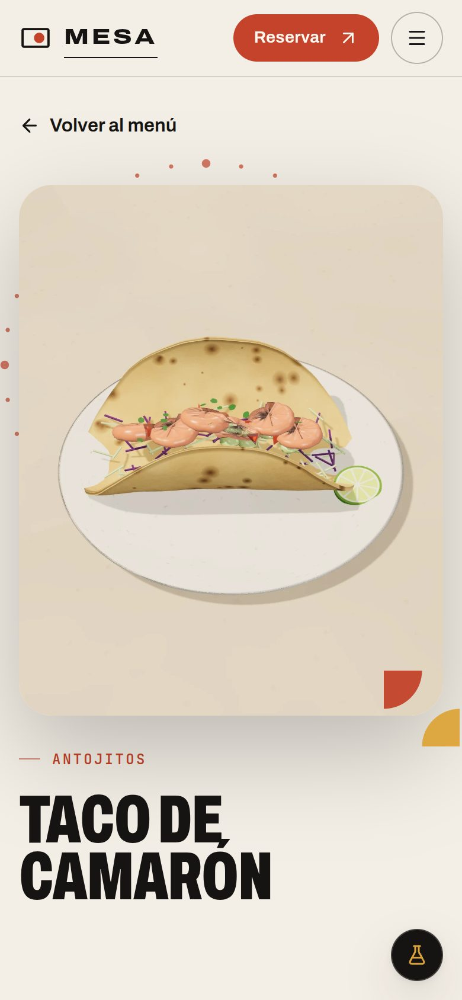
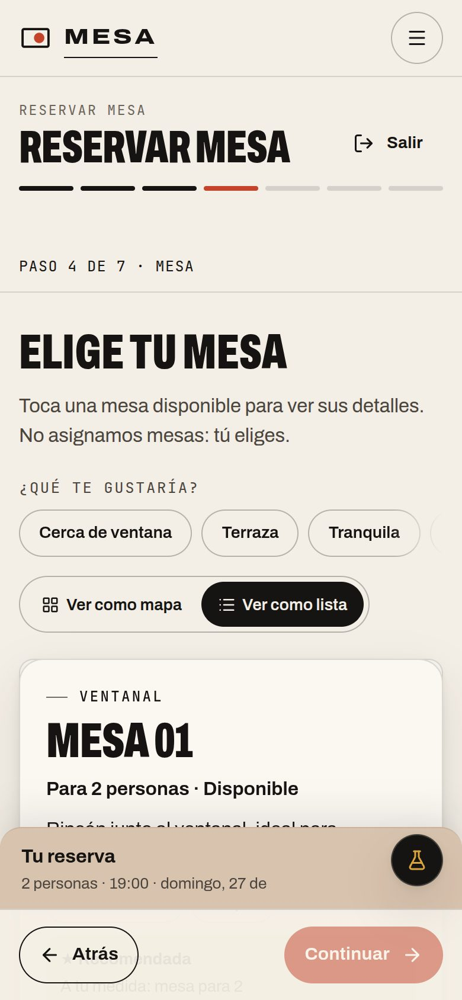

# MESA — Reserva la mesa exacta, no solo la hora

**Mesa** es un restaurante mexicano contemporáneo **ficticio** del Barrio Antiguo de Monterrey, creado como caso de estudio de diseño y desarrollo front-end. En la web, el comensal:

- ve el salón y elige **la mesa exacta** en un plano interactivo;
- confirma su reserva en menos de dos minutos;
- después la consulta, la cambia o la cancela sin crear una cuenta.

El restaurante tiene su propio panel de administración.



| Menú | Detalle de platillo |
|---|---|
|  |  |
| **Reserva: elige tu mesa** | **Panel de administración** |
|  |  |

<p align="center">
  
  
  
</p>

## Qué incluye

**Sitio público**
- **Portada:** taco 3D en vivo (Three.js) que se abre en capas con el scroll y sigue al cursor. Además: concepto, platillos destacados, reseñas filtrables, mapa ilustrado y llamada a reservar.
- **Menú:** 25 platillos con pestañas fijas, filtros de dieta y una página de detalle por platillo con transición de imagen compartida.
- **Reserva guiada en 7 pasos:**
  - calendario con disponibilidad real y alternativas cuando algo no está libre;
  - plano de mesas accesible por teclado, con recomendaciones;
  - aviso si alguien toma la mesa mientras decides;
  - bloqueo de reservas duplicadas por teléfono.
- **Mis reservas:** acceso con código y teléfono para consultar, modificar (con comparación antes/después) o cancelar.
- **Caso de estudio en `/proyecto`:** reto, sistema visual, proceso, métricas y accesos a las demos.

**Panel de administración (`/admin`)**
- Dashboard del día: KPIs, mapa por horario y próximas reservas.
- Reservas con filtros en la URL, acciones e historial de cambios.
- Menú con editor, fotos subidas por el restaurante, platillos agotados u ocultos, y papelera.
- Bloqueo de mesas.

**Detalles de experiencia**
- Pantalla de entrada y transiciones entre páginas con View Transitions.
- Scroll suave (Lenis + GSAP) e interruptor «Reducir movimiento».
- Persistencia local con sincronización entre pestañas.

## Datos de demostración

| Qué | Valor |
|---|---|
| Reserva de ejemplo | `MESA-4F7K` · teléfono `81 1234 5678` |
| Administrador | usuario `admin` · contraseña `mesa-demo` |

Las fechas del seed son relativas al día actual, así la demo siempre tiene reservas vigentes. El botón **«Prueba estas funciones»** guía los casos clave y permite restablecer la demo.

## Calidad

Medido sobre el build de producción:

| Métrica | Resultado |
|---|---|
| Lighthouse · Rendimiento (escritorio) | **97–99** en las 6 páginas públicas |
| Lighthouse · Rendimiento (móvil, 4× CPU) | 77–89 |
| Lighthouse · Accesibilidad / Buenas prácticas / SEO | **100 / 100 / 100** |
| CLS | 0 en todas las páginas |
| axe-core | 0 violaciones en 16 rutas, a 390 y 1440 px |
| Pruebas | 28 unitarias (reglas de negocio) + 7 flujos E2E (escritorio y móvil) |

**Cómo se logra**
- three.js (140 KB gzip) se descarga solo tras la primera interacción. Antes, el hero muestra un render WebP de 60 KB generado desde la misma escena, así que el paso a 3D no se nota.
- En teléfonos se usa siempre ese render.
- Chunks separados por vendor, rutas con `lazy`, precarga de las fuentes críticas y `min-height` en el contenido para no provocar saltos de layout.

## Stack

React 19 · TypeScript · Vite · React Router 7 · Three.js · GSAP + ScrollTrigger · Lenis · View Transitions API · IndexedDB · Vitest · Playwright. El CSS está escrito a mano, sin framework, con tokens de diseño.

## Comandos

```bash
npm install
npm run dev            # desarrollo en http://localhost:5173
npm run build          # typecheck + build de producción (dist/)
npm run build:pages    # build para GitHub Pages (base /Restaurant-Web/ + 404.html)
npm run build:hash     # build portable con HashRouter y rutas relativas (dist-hash/)
npm run preview        # sirve dist/
npm test               # pruebas unitarias
npm run test:e2e       # pruebas E2E (Playwright)
npm run render:dishes  # vuelve a renderizar las fotos 3D de los platillos
npm run brand          # regenera og.jpg e iconos
node scripts/readme-shots.mjs   # regenera estas capturas (tras npm run build)
```

## Publicar

- **GitHub Pages:** el workflow `.github/workflows/deploy.yml` publica al hacer push a `main`. Hay que activar *Settings → Pages → Source: GitHub Actions*. La URL queda en `https://<usuario>.github.io/Restaurant-Web/`.
- **Vercel o Netlify:** importa el repo con el comando `npm run build` y el directorio `dist`. `vercel.json` y `public/_redirects` ya incluyen el fallback de SPA.
- **Dominio propio:** define `VITE_SITE_URL=https://tu-dominio/` al construir para que `og:image` y `og:url` apunten ahí.

## Fotografía de platillos

Las imágenes de `public/images/dishes/` son **renders 3D procedurales**: geometrías y texturas generadas en código (`src/three/`) y renderizadas con un estudio automatizado (`studio.html` + Playwright).

Para usar fotografía real:
1. Genera las fotos con los prompts FP-01…FP-25 de `docs/MESA-VISUAL-PROMPTS.txt`.
2. Súbelas desde **Admin → Menú → editar platillo**, o reemplaza el `.webp` que tenga el mismo *slug*.

## Estructura

```
src/
  domain/     reglas de negocio puras (disponibilidad, validación, menú, métricas)
  store/      persistencia (localStorage + IndexedDB), sesión y acciones
  data/       seed: menú, reservas y reseñas
  three/      kit 3D procedural, escena del hero y recetas de cada platillo
  components/ UI compartida (plano de mesas, calendario, diálogos, toasts…)
  pages/      home, menú, reservar, mis reservas, caso de estudio
  admin/      panel de administración
  styles/     tokens y estilos base
docs/         planeación del producto (PRD, flujos, reglas, pruebas, dirección de arte)
tests/        unit (Vitest) y e2e (Playwright)
```

## Autor

Diseño UX/UI y desarrollo front-end: **GamesFullZ**. El restaurante, sus reseñas y sus datos son ficticios.
